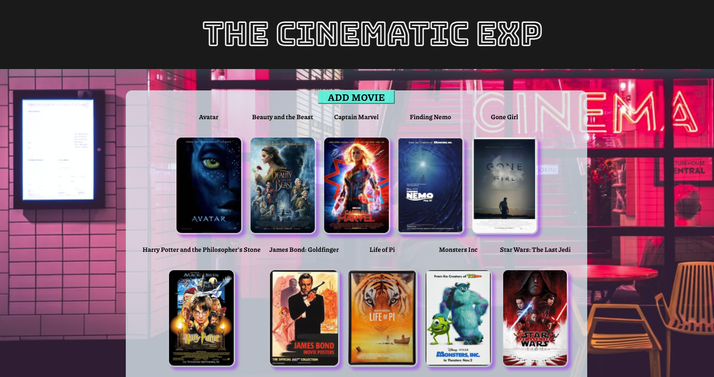
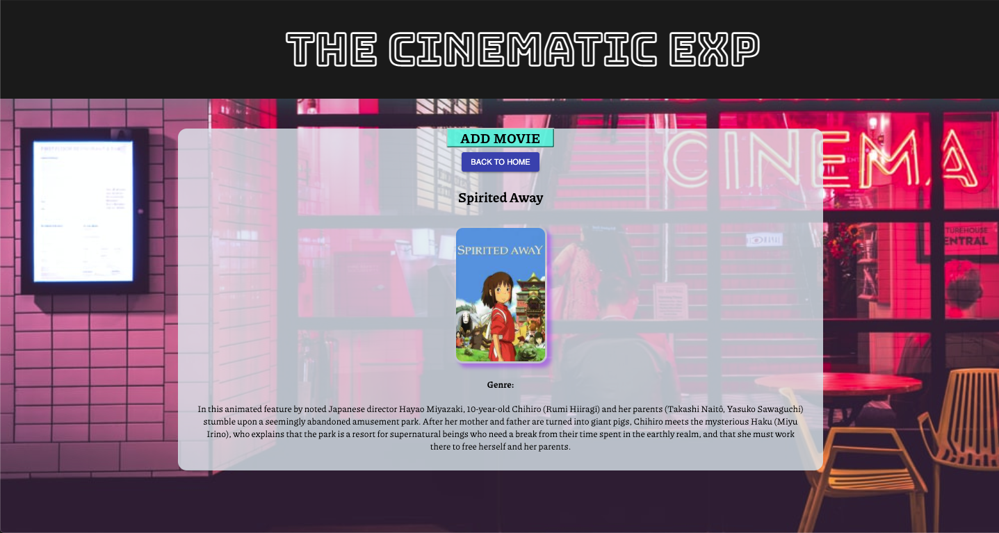
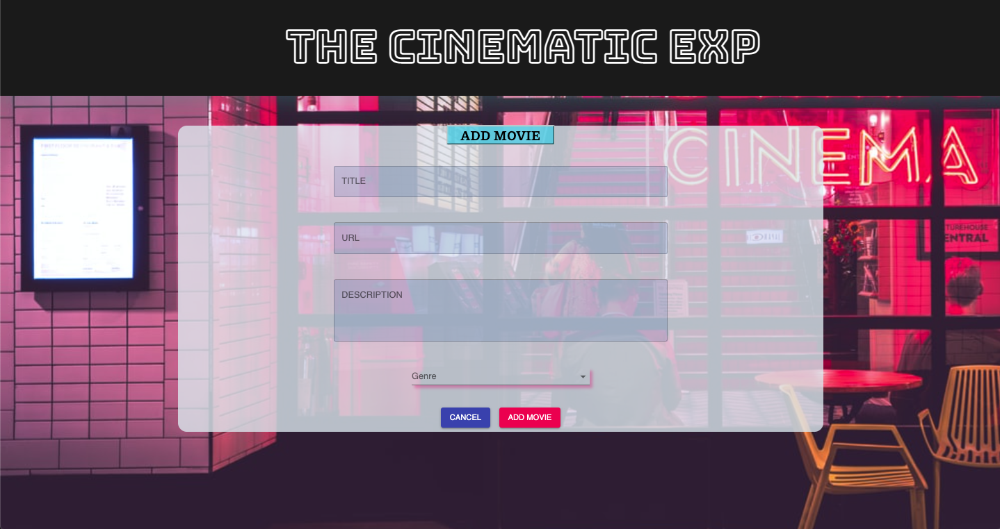

# MOVIE SAGA

## Description

_Duration: 35 hours

Create an application where user can click on movie upon landing page with movies listed. Upon clicking on specified movie, user will be directed to a new view with the details of the movie selected. User will also have option to add their own personal choice of movie, url, description, and select genre.  

### Prerequisites
* Node.js
* Postico (optional for DB)
* Postman (optional for server testing)

### Screenshots

* Landing View

* Details View

* Add Movie View

## Installation

1. Create a database named `saga_movies_weekend`,
2. The queries in the `database.sql` file are set up to create all the necessary tables and populate the needed data to allow the application to run correctly. The project is built on [Postgres](https://www.postgresql.org/download/), so you will need to make sure to have that installed. We recommend using Postico to run those queries as that was used to create the queries, 
3. Open up your editor of choice and run an `npm install`
4. Run `npm run server` in your terminal
5. Run `npm run client` in your terminal
6. The `npm run client` command will open up a new browser tab for you!
7. Run `npm install @material-ui/core` for Material-UI styling

## Usage

1. Open browser
2. Click on movie of choice
3. Add Movie 
    (include title, 
                description, 
                    valid URL, 
                        and select genre)
4. Submit, return to landing page

## Built With

* HTML5
* CSS
* JavaScript
* React
* Redux
* Material UI
* Sagas

## Acknowledgement
Thanks to [Prime Digital Academy](www.primeacademy.io) who equipped and helped me to make this application a reality. Additionally, I'd like to thank Cassen Gerber, James Posey, and Malik Elate from the Vatti cohort of Prime Digital Academy for their guidance and code reviews.

## Support
If you have suggestions or issues, please email me at [maivyerthao@gmail.com] 